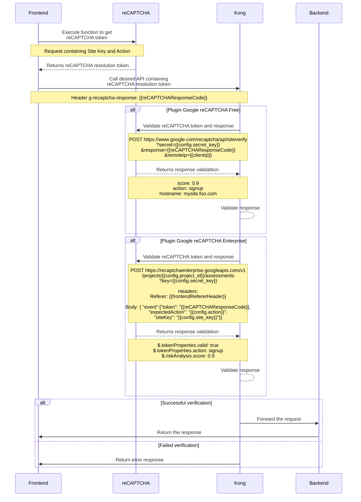

# kong-plugin-google-recaptcha
A Kong plugin to implement Google reCAPTCHA validation in services or routes

## Description

This plugin simplifies **Google reCAPTCHA** validation by automatically extracting the reCAPTCHA response from incoming request headers or the request body. It then calls Google's validation endpoint to verify the token. Based on the validation status and a configurable score threshold (for reCAPTCHA v3/Enterprise), the plugin either forwards the request to the upstream service or returns a **customizable HTTP status code** and error message to the client. This allow for flexible handling of failed reCAPTCHA verifications.



## Getting Started

### Dependencies

- This plugin requires Lua version 5.1 or higher.
- lua-resty-http
- lua-cjson

## Installing

This plugin is provided as a Luarocks module:

```sh
luarocks install kong-google-recaptcha-plugin
```

To add this plugin to Kong, check [Installation and distribution of custom plugins](https://developer.konghq.com/custom-plugins/installation-and-distribution/)

## Plugin Configuration

This plugin can be configured on route level, service level or globally

### Example

#### Example to configure Google reCAPTCHA v3

```yaml
plugins:
  - name: google-recaptcha
    config:
      site_key: '{vault://env-vault/SITE_KEY}'
      secret_key: '{vault://env-vault/SECRET_KEY}'
      version: v3
      score_threshold: 0.8
      captcha_response_name: g-recaptcha-response
      action_name: signup
      display_errors: false
      error_message: Error validating reCAPTCHA response. Please, try again later
      enterprise: true
      project_id: project-id-1234
      skip_recaptcha_for_internal_ips: false
```

### Parameters

| Parameter | Type | Description |
|---|---|---|
| name<br>`required` | `string` | The name of the plugin, in this case google-recaptcha |
| config.site_key<br>`required` | `string` | Site Key from Google |
| config.secret_key<br>`required` | `string` | Secret Key from Google (API Key for reCAPTCHA Enterprise) |
| config.action_name<br>`required` | `string` | The reCAPTCHA action name defined in integration.<br>This value must be equal to configured in the website, otherwise the plugin will block the request. |
| config.version<br>`optional` | `string`<br>can be only v2 or v3 | Google reCAPTCHA version<br>default: `v2` |
| config.score_threshold<br>`optional` | `number`<br>between 0 and 1 | Score threshold to validate against Google reCAPTCHA response<br>default: `0.8` |
| config.enterprise<br>`optional` | `boolean` | Indicates whether to use reCAPTCHA Enterprise.<br>Set to `true` to enable, or `false` to disable.<br>default: `false` |
| config.project_id<br>`optional` | `string` | Specifies the project ID for reCAPTCHA Enterprise.<br>Required if `config.enterprise` is set to `true` |
| config.captcha_response_name<br>`optional` | `string` | The name of the header or body property to look for Google reCAPTCHA response token<br>default: `g-recaptcha-response` |
| config.error_message<br>`optional` | `string` | Set a custom error message to return when the Google reCAPTCHA validation is failed<br>default: `reCAPTCHA verification failed` |
| config.error_code<br>`optional` | `number` | Set a custom error code to return when the Google reCAPTCHA validation is failed<br>default: `403` |
| config.display_errors<br>`optional` | `boolean` | When set to `true`, specific error details will be included in the failure responses returned to the client.<br>default: `false` |
| config.skip_recaptcha_for_internal_ips<br>`optional` | `boolean` | When set to `true`, reCAPTCHA valitation will be skipped for requests from internal IP addresses (RFC1918).<br>Set to `true` to allow internal traffic to bypass reCAPTCHA verification.<br>default: `false` |

> **_NOTE_**: This plugin will first search for the reCAPTCHA response in the request header named as configured in `config.captcha_response_name`. If not found, it will then check the request body for an attribute with the same name. If the token is not provided in either the headers or the body, the validation will fail.